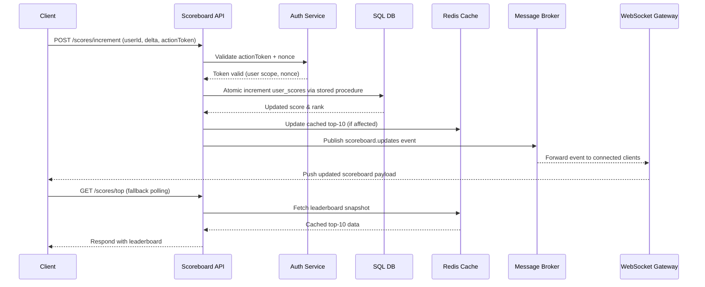

# Problem 6 — Live Scoreboard Module Specification

## Overview

This document defines the backend module responsible for ingesting score updates, enforcing security constraints, and distributing live scoreboard changes to connected clients. The goal is to provide a reliable and tamper-resistant pipeline that keeps the top 10 leaderboard current in near real-time.

## Objectives

- Accept score increment requests generated by trusted actions on the website.
- Validate that each update is authentic and authorised for the acting user.
- Persist scoreboard data in a durable store.
- Broadcast scoreboard changes to online users with minimal latency.
- Expose APIs that allow other services or the frontend to query current standings.

## Module Responsibilities

1. **API surface**
   - `POST /scores/increment` — adds points to a user score after validation.
   - `GET /scores/top` — returns cached top-10 scoreboard entries.
   - `GET /scores/:userId` — retrieves an individual user’s current score and rank.
2. **Authorisation & integrity**
   - Verify signed action tokens (or short-lived JWTs) issued alongside the client action.
   - Cross-check action replay/nonces to prevent double-spend.
   - Enforce role- or scope-based permissions (e.g. moderators can add bonus points).
3. **Data management**
   - Maintain score totals in a database table (`user_scores`).
   - Use atomic increment operations to avoid race conditions.
   - Cache top-10 results in Redis (or similar) for fast reads.
4. **Real-time distribution**
   - Publish score changes to a message bus channel (`scoreboard.updates`).
   - Push updates to WebSocket subscribers (or SSE) via a real-time gateway service.
5. **Auditing & observability**
   - Log update attempts and outcomes with correlation IDs.
   - Emit metrics (rate of score increments, cache hit ratio, auth failures).

## Execution Flow



## Data Model Sketch

| Table          | Key fields                                                | Notes                                                |
|----------------|-----------------------------------------------------------|------------------------------------------------------|
| `user_scores`  | `user_id` (PK), `score`, `updated_at`, `version`          | `score` updated atomically; `version` for optimistic locking |
| `score_events` | `id`, `user_id`, `delta`, `source`, `nonce`, `created_at` | Stores immutable event history for auditing          |
| `action_nonces`| `nonce` (PK), `user_id`, `expires_at`, `consumed`         | Detects replay; can live in Redis for quick expiry   |

## API Contracts

### `POST /scores/increment`

- **Headers:** `Authorization: Bearer <JWT>`, `X-Action-Nonce`
- **Body:** `{ "userId": "uuid", "delta": number, "actionToken": "string" }`
- **Responses:**
  - `200 OK` → `{ "score": number, "rank": number }`
  - `400 Bad Request` → invalid payload or nonce reused
  - `401/403` → auth failure
  - `409 Conflict` → stale version, client should retry

### `GET /scores/top`

- **Query params:** optional `limit` (default 10, max 50)
- **Response:** `{ "entries": [{ "userId": string, "score": number, "rank": number }], "generatedAt": ISO8601 }`
- Served from cache; cache warmed/invalidated on increment events.

### `GET /scores/:userId`

- Returns `{ "userId": string, "score": number, "rank": number, "lastUpdated": ISO8601 }`.
- Falls back to DB if cache miss occurs.

## Security Considerations

- **Action authenticity:** Use short-lived signed tokens issued server-side when the allowable action is granted. Tokens embed `userId`, `delta`, expiry, and an HMAC signature.
- **Replay protection:** Each request must provide a nonce stored in Redis (TTL ~5 minutes). Nonce is marked consumed inside the same transaction as the score increment.
- **Rate limiting:** Apply per-user and per-IP rate limits (e.g., via Redis or API gateway) to mitigate brute-force attempts.
- **Transport security:** Enforce HTTPS and HSTS; reject mixed content.
- **Monitoring:** Trigger alerts when increments exceed expected thresholds (possible abuse).

## Module Interfaces

- **Inbound dependencies**
  - Auth service (JWT validation, token introspection)
  - Message broker (Kafka, NATS, or RabbitMQ)
  - Cache layer (Redis cluster)
  - Primary database (PostgreSQL recommended)
- **Outbound contracts**
  - Emits `scoreboard.updates` events `{ userId, score, rank, updatedAt }`
  - Exposes REST endpoints described above
  - Provides TypeScript interface for internal SDK:

```ts
interface ScoreboardService {
  incrementScore(userId: string, delta: number, actionToken: string, nonce: string): Promise<{ score: number; rank: number }>;
  getTopScores(limit?: number): Promise<Array<{ userId: string; score: number; rank: number }>>;
  getUserScore(userId: string): Promise<{ userId: string; score: number; rank: number }>;
}
```

## Operational Notes

- Deploy as a horizontally scalable stateless service; rely on database and cache for coordination.
- Leverage database transactions (`SERIALIZABLE` or row-level locking) to keep increments linearizable.
- Keep leaderboard cache warm by recomputing top-N in-memory whenever an affected user enters/exits the top slice.
- Expose Prometheus metrics: `score_increment_total`, `score_increment_failures_total`, `scoreboard_update_latency_ms`.
- Enable structured logging with request IDs for traceability.

## Improvement Ideas

1. **Batch processing:** If traffic is high, aggregate increments per user via a stream processor to reduce DB write contention.
2. **Zero-trust tokens:** Replace simple HMAC tokens with signed proof-of-action objects issued by a dedicated policy engine.
3. **Geo-distribution:** Use read replicas or edge caches for the top-10 API to serve global audiences with low latency.
4. **Client SDK:** Deliver a shared TypeScript/Swift SDK to abstract nonce handling and WebSocket reconnection logic.
5. **Replay analytics:** Feed `score_events` into a fraud detection pipeline to flag anomalies automatically.

